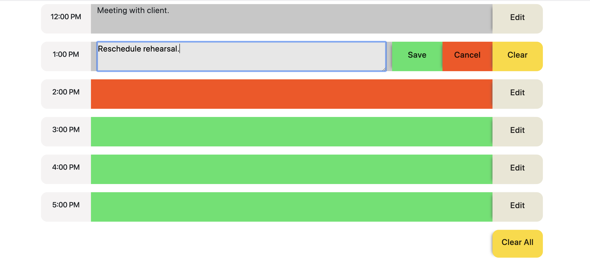

# Work Day Scheduler

## Overview

This app was created for the University of Richmond coding bootcamp.

#### LIVE LINK : https://reyesdmusic.github.io/work_day_scheduler//

## Features

- 9 rows reflect each hour in a business day, 9am to 5pm. 

- The current day and date is rendered beneath the main header.

- Each row dynamically changes colors to reflect whether that given hour is in the    past, current, or in the future. Grey, red, and green, respectively.

- The edit button reveals three buttons, "Save", "Cancel", and "Clear".

- User inputs are saved in local storage, so the content persists upon refreshing the page.

- "Clear All" button empties local storage and refreshes the page.

## UI 

## Tech Used / Dependencies

- Date and time info from: [Moment.js](https://moment.js.com/)

- Fonts from [Google Fonts](https://fonts.google.com/)

- Favicon from [Favicon.io](https://https://favicon.io/)
